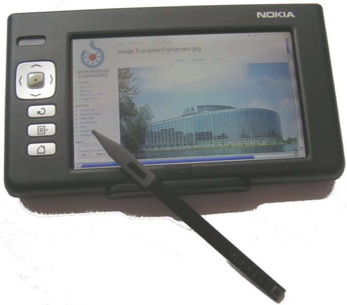
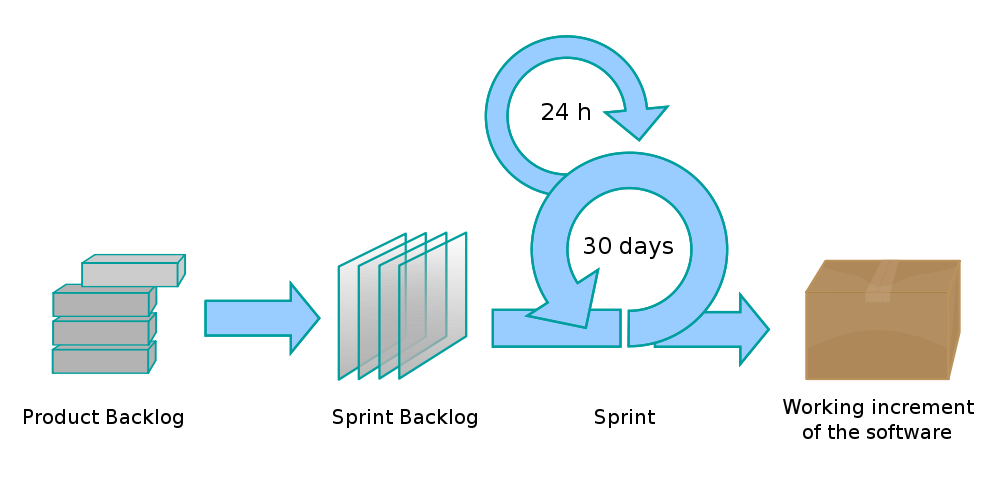

Scrum kohtaa prototypointiprojektin
===================================

Ilkka Laukkanen, 2010

 
<small>Tämän teosteoksen käyttöoikeutta koskee <a rel="license"
href="http://creativecommons.org/licenses/by-sa/3.0/">Creative Commons
Nimeä-Tarttuva 3.0 Muokkaamaton-lisenssi</a>.</small>

----

Mikä mies?
==========

*   Teekkari, TTKK 2000
*   Tutkimusapulainen, Ohjelmistotekniikan laitos 2003

 
<small>Nokia N770</small>

----

Mikä mies?
==========

<object width="480" height="385"><param name="movie"
value="http://www.youtube.com/v/CD2V8GFqk_Y?fs=1&amp;hl=fi_FI"></param><param
name="allowFullScreen" value="true"></param><param name="allowscriptaccess"
value="always"></param><embed
src="http://www.youtube.com/v/CD2V8GFqk_Y?fs=1&amp;hl=fi_FI"
type="application/x-shockwave-flash" allowscriptaccess="always"
allowfullscreen="true" width="480" height="385"></embed></object>

*   Software Specialist, John Deere Forestry

 

 
<small>TM The Linux Foundation</small>

*   Software Lead Engineer, Sasken Finland 2008
*   CSM 2009
*   DI, ohjelmistotuotanto 2010

----

Luentojen rakenne
=================

1.  Lähtökohdat ja projektin kuvaus
2.  Projektin kulku ja työtapojen hioutuminen
3.  Retrospektiivi

----

Lähtökohdat
===========

*   Tehtävänä uudenlaisten mobiili-UI-konseptien suunnittelu ja prototypointi
*   Tiimi 1-2 graafista suunnittelijaa ja 2-4 koodaria
*   Scrum?
    *   Koska ollaan ketteriä
    *   ...eli koska ei ole speksiä

----

Niin, mutta mikä Scrum?
=======================

----

Alussa oli...
=============

*   2 suunnittelijaa, 2 koodaria
*   Kätevää huudella käytävän yli
*   Koko tiimin tila päässä yhdellä kertaa

----

Alkuvaiheen prosessi
====================

*   Viikkopalaverit asiakkaan kanssa
*   Valmiin demoaminen
*   "Seuraavaksi voisi..."
*   Konseptien iterointi
*   &rarr; Käytännössä viikon sprintti

----

Scrum-but
=========

*   Ei product backlogia
*   Ei estimointia
*   &rarr; Ei ennustettavuutta

----

Mitä me oltiinkaan tekemässä?
=============================

*   Ei pitkän tähtäimen suunnitelmia
*   Kuviot uusiksi viikon välein?
*   Prototypointihan se

----

Saavuttamisen ilmapiiri
=======================

*   Jos ei ole suunnitelmia...
*   Mitään ei tunnu tapahtuvan
*   Kuka jaksaa?
*   Scrumissa on kyse myös ihmisistä

----

Koita ujuttaa nämä johonkin
===========================

Luento 2:

The Fall of the House of Scrum

Luento 3:

What is Scrum compared to the hand that wields it?

