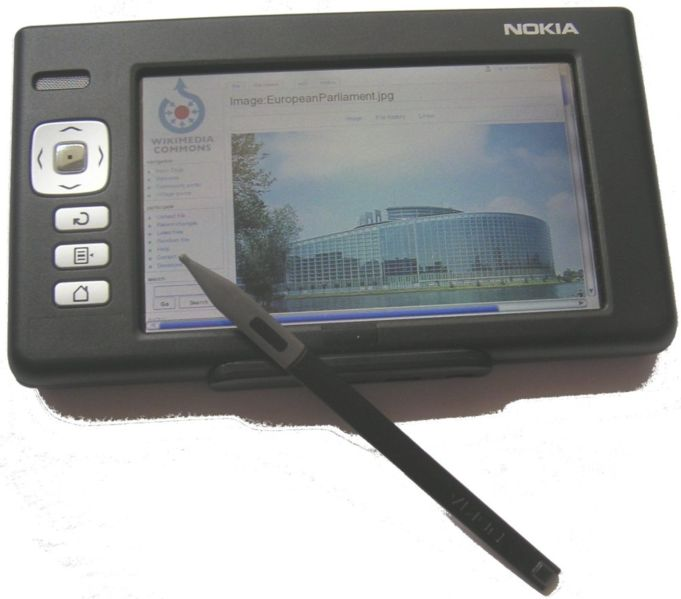
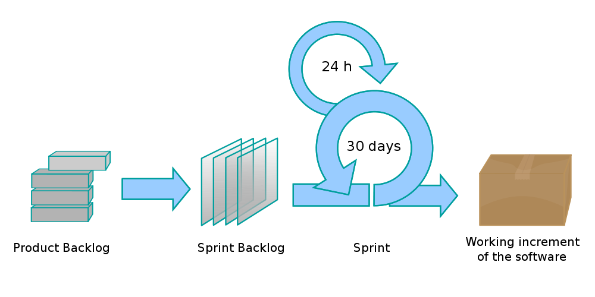

Scrum kohtaa prototypointiprojektin
===================================

Ilkka Laukkanen, 2011

<a
href="http://github.com/ilkka/otm2011">github.com/ilkka/otm2011</a>

 
<small>Tämän teosteoksen käyttöoikeutta koskee <a rel="license"
href="http://creativecommons.org/licenses/by-sa/3.0/">Creative Commons
Nimeä-Tarttuva 3.0 Muokkaamaton-lisenssi</a>.</small>

----

Mikä mies?
==========

 
<small>Nokia N770</small>

* Teekkari, TTKK 2000
* Tutkimusapulainen, Ohjelmistotekniikan laitos 2003
    * Tavoitetutkimusta mobiilista Internetistä

----

Mikä mies?
==========

<object width="480" height="385"><param name="movie"
value="http://www.youtube.com/v/CD2V8GFqk_Y?fs=1&amp;hl=fi_FI"></param><param
name="allowFullScreen" value="true"></param><param name="allowscriptaccess"
value="always"></param><embed
src="http://www.youtube.com/v/CD2V8GFqk_Y?fs=1&amp;hl=fi_FI"
type="application/x-shockwave-flash" allowscriptaccess="always"
allowfullscreen="true" width="480" height="385"></embed></object>

* Software Specialist, John Deere Forestry, 2006
* Dippa: Kunnonvalvontajärjestelmän sovittaminen Linux-ympäristöön

----

Mikä mies?
==========

* Software Lead Engineer, Sasken Finland 2008

 

* Certified Scrum Master 2009

----

Mikä mies?
==========

 
<small>TM The Linux Foundation</small>

* Software Architect, Sasken Finland 2010
* DI, ohjelmistotuotanto 2010

----

Luentojen rakenne
=================

1.  Lähtökohdat ja projektin kuvaus

2.  Projektin kulku ja työtapojen hioutuminen

3.  Retrospektiivi

----

Lähtökohdat
===========

* Tehtävänä uudenlaisten mobiili-UI-konseptien suunnittelu ja prototypointi

* Tiimi 1-2 graafista suunnittelijaa ja 2-4 koodaria

* Scrum?
    * Koska ollaan ketteriä
    * ...eli koska ei ole speksiä

----

Niin, mutta mikä Scrum?
=======================

----

Scrumin sidosryhmät
===================

* Scrum team
    * sekajoukkueet

* Scrum master
    * prosessin omistaja

* Product owner
    * tuotteen suunnan määrittäjä

----

Scrum ja Agile
==============

* Scrum on ketterä metodologia

* Agile?
    * **Individuals and interactions** over processes and tools
    * **Working software over** comprehensive documentation
    * **Customer collaboration** over contract negotiation
    * **Responding to change** over following a plan

* [Agile Manifesto](http://agilemanifesto.org/)

----

Alussa oli...
=============

* 2 suunnittelijaa, 2 koodaria

* Kätevää huudella käytävän yli

* Koko tiimin tila päässä yhdellä kertaa

----

Alkuvaiheen prosessi
====================

* Viikkopalaverit asiakkaan kanssa

* Valmiin demoaminen

* "Seuraavaksi voisi..."

* Konseptien iterointi

* *Customer collaboration*

* &rarr; Käytännössä viikon sprintti

----

Scrum-but
=========

* Ei product backlogia

* Ei estimointia

* &rarr; Ei ennustettavuutta

----

Mitä me oltiinkaan tekemässä?
=============================

* Ei pitkän tähtäimen suunnitelmia

* Kuviot uusiksi viikon välein?

* Prototypointihan se

----

Saavuttamisen ilmapiiri
=======================

* Jos ei ole suunniteltuja tavoitteita...

* ...ei niitä voi saavuttaakaan

* Ei ketteryys tätä tarkoita

----

Kommunikointi
=============

* **People and Interactions** before processes and tools
  
* Sprinttiplänäys
    * Seuraavan sprintin sisältö backlogista

* Daily Scrum
    * Päivittäistä seurantaa ja ongelmanratkomista

* Sprintin katselmointi
    * Tuotoksen tarkastaminen

* Retrospektiivi
    * Prosessin parantaminen

----

Sprinttiplänäys
===============

* Seuraavan parin viikon työt

* Poisheitettävää koodia

* Ei "ounersippia"

    * &rarr; ei edes kovin konkreettisia plänejä

----

Daily Scrum
===========

* Pitää tutkia laajalti

* &rarr; omat projektit

* &rarr; daily scrum lähinnä jutustelua

* Ymmärrys ei leviä

----

Sprint Review
=============

* By the book :)

* Sisäänrakennettu vastuunkanto
    * Keskeinen idea, tutkitaanpa &rarr;

----

"Single Wrenchable Neck"
========================

<iframe title="YouTube video player" class="youtube-player" type="text/html"
width="640" height="390" src="http://www.youtube.com/embed/6rNuP674T0w"
frameborder="0" allowFullScreen></iframe>

----

Porkkana? Tässä mitään porkkanoita tarvita
==========================================

* Asioita tapahtuu kun jonkun maine, kunnia tai tilipussi on tulilinjalla

* Eli "ounersippi" kohdillaan

* &rarr; Jokaisella tehtävällä pitää olla tekijänsä

* Tehtävä näytetään tehdyksi demoamalla tuotos

* &rarr; Jokaisen tehtävän tulee kuulua tuotokseen

----

Retrospektiivi
==============

* Ei paljoa parannettavaa...

* ...kun ei käytännössä *ole* prosessia

* "Tarttis tehdä jotain" -tyylistä jutustelua

* Myös aikataulutusongelma: prosessi vs. tuotokset

* ...ja asiakaskin halusi mahdollisimman kevyttä

----

Toisaalta!
==========

* Pienessä porukassa on etunsa

* Voitiin demota ideoita nopeasti

* Voitiin vaihtaa suuntaa lennosta

* Asiat hoituivat devarien kesken jutustellen

----

Sitten joku kysyy vaikeita
==========================

* Projektipäällikkö tulee Leadin juttusille: "missäs mennään?"

* Single wrenchable neck...

* Omista tehtävistä pystyy tekemään lukua mutta ei enää koko projektista

* Tarvitaan Prosessi

----

Prosessi hankaliin kysymyksiin vastaamisen fasilitoimiseksi
===========================================================

  <!--brrr...-->

* Scrum!

<!--
Koita ujuttaa nämä johonkin
===========================

Luento 2:

The Fall of the House of Scrum

Luento 3:

What is Scrum compared to the hand that wields it?

vim: sw=4 sts=4 et filetype=markdown
-->
