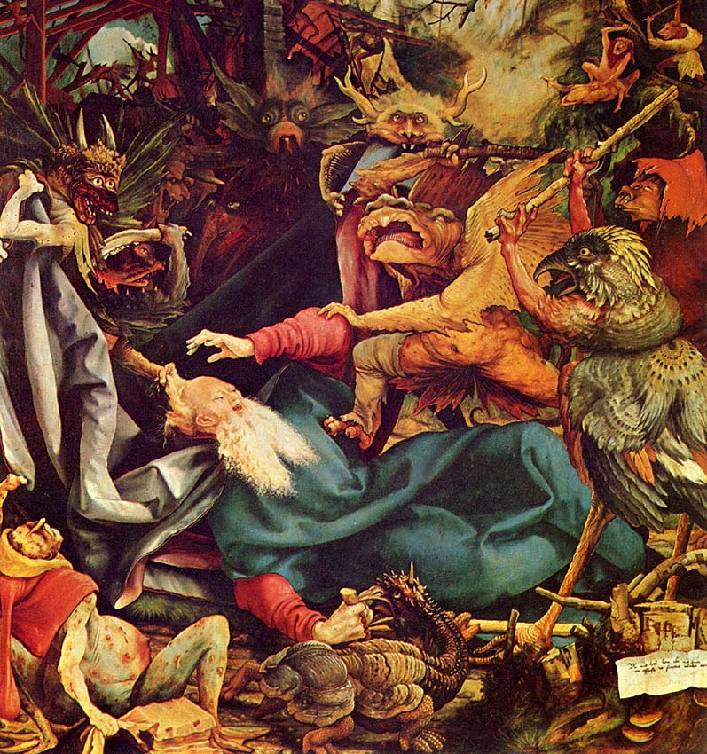

!SLIDE subsection transition=slideX
# Suunnittelu #

!SLIDE  bullets incremental transition=slideX
# Ongelma: #

* Ei ennustettavutta
* Ei tavoitteiden saavuttamisen fiilistä
* Ei kuvaa projektin etenemisestä

!SLIDE bullets incremental transition=slideX
# Ennustettavuus #

* Siis työmääräarviot
* Ja toteutumien seuranta
* => projektiot

!SLIDE bullets incremental transition=slideX
# Työmääräarviot #

* Alussa tehtävien tekijöiden vastuulla
* Arviot tunteina
* ...mutta käytännössä päivinä
* Kokemusta vähän
* Tarkkuus heikko

!SLIDE incremental transition=slideX center
# Arvioton aika #

!SLIDE bullets incremental transition=slideX
# Planning poker #

* Abstraktit story pointit
* Kaikki osallistumassa
* Ei tunnu niin konkreettiselta sitoumukselta

!SLIDE bullets incremental transition=slideX
# Seuranta #

* Alussa firman oma Jira
* Raskas... hyvässä ja pahassa
* Plugareilla varsin hyvä Scrum-tuki
* Taskihierarkia hyödyllinen splittaamisessa
* Konkreettiset yksiköt pakkomielle

!SLIDE bullets incremental transition=slideX
# Trac #

* Yhtenäistäminen muiden tiimien kanssa
* Milestonet == sprintit
* Yksitasoiset taskit
* Simppelimpi... hyvässä ja pahassa

