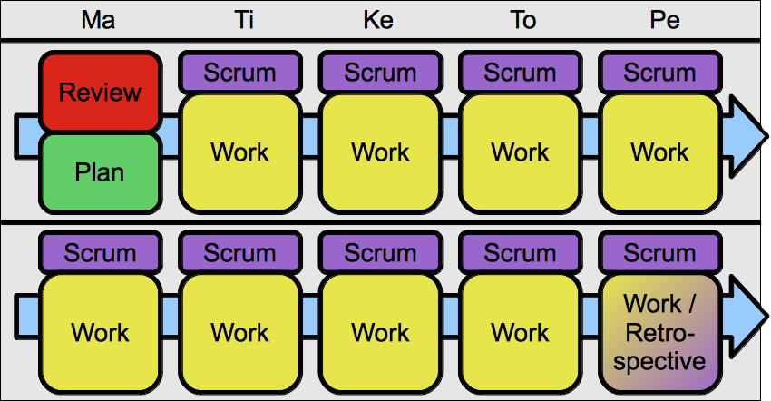

!SLIDE subsection
# Palaverit #

!SLIDE center
# Aikatauluraami #

!SLIDE bullets incremental
# Aikatauluraami #

* Säännöllisyys
* Työrauha
* Ennustettavuus

!SLIDE bullets incremental
# Sprint review #

* Aamulla
* Viikon alussa
* Sisältö pidettävä kurissa
* Kaikki uudet ideat suoraan PBIksi

!SLIDE bullets incremental
# Sprint planning #

* Reviewin jälkeen
* Kesto pidettävä kurissa
* Ehkä jako brainstormaukseen ja tiimin plänäykseen
* Planning poker

!SLIDE bullets incremental
# Daily scrum #

* Aamuisin
* Muttei liian aikaisin
* Taululla

!SLIDE bullets incremental
# Retrospektiivi #

* Parin viikon välein
* Pari tuntia
* Projektin viikkopalaverin paikalla
