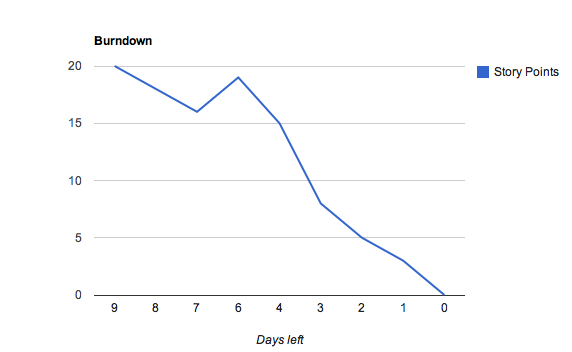

!SLIDE bullets oneatatime
# Työkalut #

!SLIDE center
# Storyja käsittelevä työkalu #

!SLIDE center
# Planning Poker #

(© Alan Dayley http://flickr.com/alandd)

!SLIDE center
# Kanban board #

(© Drew Stephens, http://flickr.com/dinomite)

!SLIDE center
# Burndown #

